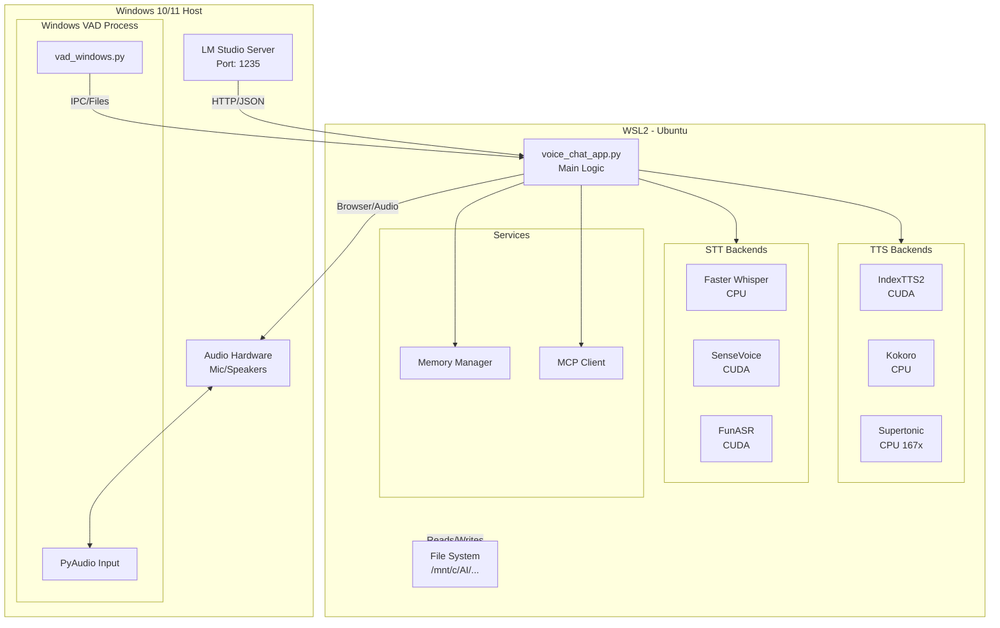
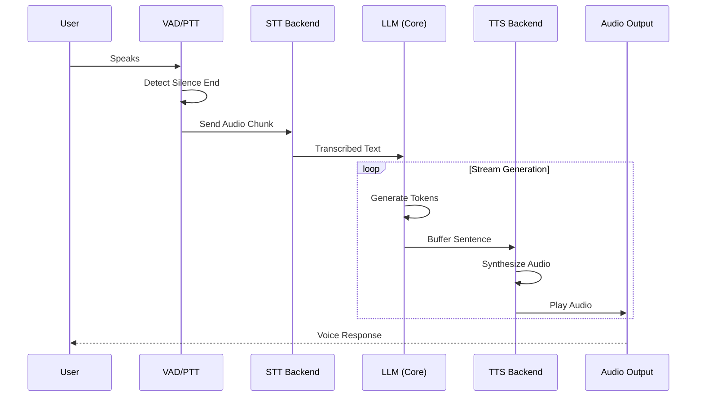
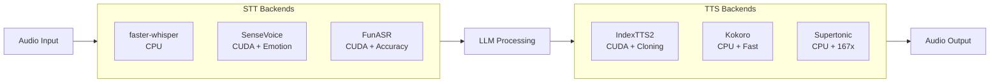
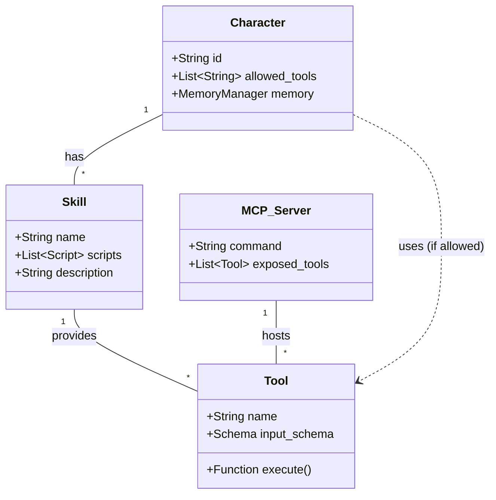

# IndexTTS2 Voice Agent - Architectural Reference

This document provides visual architectural diagrams for the IndexTTS2 Voice Agent system, focusing on the hybrid WSL/Windows deployment, the four-layer memory system, and the Model Context Protocol (MCP) integration.

## 1. Hybrid System Context (WSL + Windows)

The system is designed to run in a hybrid environment where the core logic resides in WSL (Linux) for better Python/Dev tooling support, while leveraging the Windows host for audio I/O and local model hosting (LM Studio).



## 2. Memory Architecture (4-Layer + Graph)

The memory system combines vector embeddings for semantic search with a structured knowledge graph for entity tracking.

```mermaid
graph TD
    UserQuery[User Input] --> Embed[Embedding Model<br/>Qwen3-0.6B-ONNX]
    UserQuery --> GraphExtract[Graph Extractor<br/>(Background)]
    
    Embed --> QueryVec[Query Vector]
    
    subgraph Memory_System [Multi-Character Memory System]
        direction TB
        
        subgraph Layer1 [Layer 1: Episodic]
            EpisodicDB[(Episodic Memory)]
            MMR[MMR Re-ranking]
            ContextWin[Short-term Context]
        end
        
        subgraph Layer2 [Layer 2: Semantic]
            SemanticDB[(Semantic Memory)]
            FactStore[Fact Retrieval]
        end
        
        subgraph Layer3 [Layer 3: Procedural]
            ProceduralDB[(Procedural Memory)]
            Behavior[Behavioral Patterns]
        end
        
        subgraph Layer4 [Layer 4: Knowledge Graph]
            GraphDB[(SQLite Graph DB)]
            Entities[Entities]
            Relations[Relationships]
            GraphRAG[GraphRAG Processor]
        end
    end
    
    QueryVec --> EpisodicDB
    QueryVec --> SemanticDB
    QueryVec --> ProceduralDB
    
    EpisodicDB --> MMR
    SemanticDB --> FactStore
    ProceduralDB --> Behavior
    GraphDB --> GraphRAG
    
    MMR --> WeightedScorer
    FactStore --> WeightedScorer
    Behavior --> WeightedScorer
    GraphRAG --> WeightedScorer
    
    WeightedScorer[Weighted Scorer<br/>0.2 Recency + 0.5 Relevance + 0.3 Importance] --> FinalContext[Final Context Context]
    
    GraphExtract -- Updates --> GraphDB
```

## 3. Voice Processing Pipeline

The pipeline handles real-time voice interaction with latency optimization features like sentence buffering and phrase caching.



## 3.1 Audio Backend Options

### STT Backends
| Backend | Device | Features | Speed |
|---------|--------|----------|-------|
| **faster-whisper** | CPU | Base STT | Standard |
| **SenseVoice** | CUDA | STT + Emotion + VAD | Fast |
| **FunASR** | CUDA | High accuracy | Accurate |

### TTS Backends
| Backend | Device | Speed | Voice Cloning |
|---------|--------|-------|---------------|
| **IndexTTS2** | CUDA | ~2x realtime | Yes |
| **Kokoro** | CPU | ~10x realtime | No (presets) |
| **Supertonic** | CPU | ~167x realtime | No (6 presets) |

### Emotion Detection
- **wav2vec2**: Standalone emotion detection (with Whisper/FunASR)
- **SenseVoice**: Built-in emotion detection (no separate model needed)



## 4. Model Context Protocol (MCP) Integration

The system acts as an MCP Host, connecting to standard MCP servers via stdio.

```mermaid
graph LR
    subgraph Host [Voice Agent App]
        LLM_Agent[LLM Agent]
        MCP_Manager[MCP Client Manager]
        Tool_Registry[Tool Registry]
    end
    
    subgraph Servers [MCP Servers]
        server1[Local Filesystem<br/>stdio]
        server2[SQLite DB<br/>stdio]
        server3[Brave Search<br/>stdio (optional)]
    end
    
    LLM_Agent -- calls tool --> MCP_Manager
    MCP_Manager -- looks up --> Tool_Registry
    
    MCP_Manager -- JSON-RPC Request --> server1
    MCP_Manager -- JSON-RPC Request --> server2
    MCP_Manager -- JSON-RPC Request --> server3
    
    server1 -- Result --> MCP_Manager
    server2 -- Result --> MCP_Manager
    server3 -- Result --> MCP_Manager
    
    MCP_Manager -- Formatted Text --> LLM_Agent
```

## 5. Tool & Skill Ecosystem


